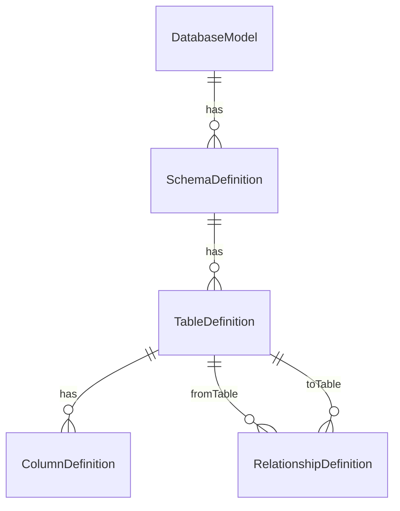
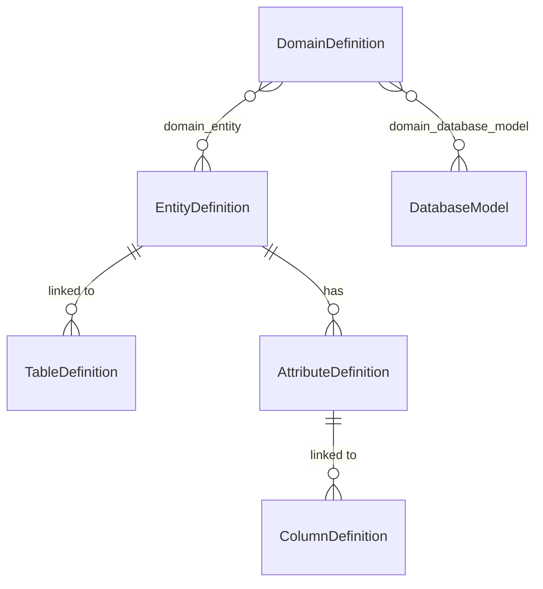

# DBDaDi Backend -- db-data-dictionary

## Project Overview

| Property        | Value                                    |
|-----------------|------------------------------------------|
| Artifact        | it.brunasti:dbdadi:0.1.0-SNAPSHOT        |
| Type            | Spring Boot REST API                     |
| Java            | 21                                       |
| Spring Boot     | 3.4.0                                    |
| Build tool      | Maven                                    |
| Default port    | 8080                                     |
| Default profile | postgres                                 |
| Swagger UI      | http://localhost:8080/swagger-ui.html    |
| OpenAPI docs    | http://localhost:8080/api-docs           |

DBDaDi (DB Data Dictionary) is a metadata management tool. The backend exposes a JSON REST API
that covers two layers of the domain:

- **Physical layer** -- DatabaseModel, Schema, Table, Column, Relationship (raw JDBC metadata)
- **Logical layer** -- Domain, Entity, Attribute (semantic annotations on top of the physical layer)

---

## Project Structure

```
db-data-dictionary/
+-- pom.xml
+-- src/
    +-- main/
    |   +-- java/it/brunasti/dbdadi/
    |   |   +-- DbdadiApplication.java          Main entry point
    |   |   +-- aspect/
    |   |   |   +-- Loggable.java               Annotation for AOP logging
    |   |   |   +-- LoggingAspect.java          Around advice: logs method + timing
    |   |   +-- config/
    |   |   |   +-- DataInitializer.java        Creates default admin user on first run
    |   |   |   +-- OpenApiConfig.java          SpringDoc / Swagger configuration
    |   |   |   +-- SecurityConfig.java         Spring Security (all endpoints open; auth at UI)
    |   |   +-- controller/
    |   |   |   +-- AlignmentController.java    POST /api/v1/alignment
    |   |   |   +-- AnalysisController.java     POST /api/v1/analysis/run|apply
    |   |   |   +-- AttributeDefinitionController.java
    |   |   |   +-- AuthController.java         POST /api/v1/auth/login
    |   |   |   +-- ColumnDefinitionController.java
    |   |   |   +-- DatabaseModelController.java
    |   |   |   +-- DomainDefinitionController.java
    |   |   |   +-- EntityDefinitionController.java
    |   |   |   +-- ErDiagramController.java    GET /api/v1/er-diagram (PlantUML)
    |   |   |   +-- ExcelExportController.java  GET /api/v1/admin/export/excel
    |   |   |   +-- ExcelImportController.java  POST /api/v1/admin/import/excel
    |   |   |   +-- JdbcImportController.java   POST /api/v1/import/jdbc
    |   |   |   +-- RelationshipDefinitionController.java
    |   |   |   +-- ResetController.java        DELETE /api/v1/admin/reset/*
    |   |   |   +-- SchemaDefinitionController.java
    |   |   |   +-- TableDefinitionController.java
    |   |   |   +-- UserController.java         CRUD /api/v1/users
    |   |   +-- dto/                            Request/response transfer objects
    |   |   +-- exception/
    |   |   |   +-- GlobalExceptionHandler.java Maps exceptions to HTTP status codes
    |   |   |   +-- ResourceNotFoundException.java  -> 404
    |   |   |   +-- DuplicateResourceException.java -> 409
    |   |   +-- model/                          JPA entities
    |   |   |   +-- enums/
    |   |   |   |   +-- DbType.java             POSTGRESQL|MYSQL|ORACLE|DB2|SQLSERVER|H2|GENERIC
    |   |   |   |   +-- RelationshipType.java
    |   |   |   |   +-- UserRole.java           ADMIN | VIEWER
    |   |   +-- repository/                     Spring Data JPA repositories
    |   |   +-- service/                        Business logic
    |   +-- resources/
    |       +-- application.properties          Base config (port 8080, active profile: postgres)
    |       +-- application-postgres.properties PostgreSQL datasource
    |       +-- application-h2.properties       H2 in-memory (dev/test)
    |       +-- application-mysql.properties    MySQL datasource
    |       +-- application-oracle.properties   Oracle datasource
    |       +-- application-db2.properties      DB2 datasource
    |       +-- sql/                            Optional seed scripts
    +-- test/
        +-- java/it/brunasti/dbdadi/
            +-- DbdadiApplicationTests.java     Context load smoke test
```

---

## Main Entry Point

```java
// DbdadiApplication.java
@SpringBootApplication
@EnableAspectJAutoProxy
public class DbdadiApplication {
    public static void main(String[] args) {
        SpringApplication.run(DbdadiApplication.class, args);
    }
}
```

`DataInitializer` runs on startup: if the `users` table is empty it creates the default
`admin / admin` account (role ADMIN). Change this password immediately after first deploy.

---

## Key Configuration Files

### application.properties (base)

```properties
server.port=8080
spring.profiles.active=postgres
spring.jpa.hibernate.ddl-auto=update
spring.jpa.open-in-view=false
springdoc.api-docs.path=/api-docs
springdoc.swagger-ui.path=/swagger-ui.html
springdoc.swagger-ui.operationsSorter=alpha
```

### application-postgres.properties

```properties
spring.datasource.url=jdbc:postgresql://localhost:5432/dbdadi
spring.datasource.username=dbdadi
spring.datasource.password=dbdadi
spring.datasource.driver-class-name=org.postgresql.Driver
```

### application-h2.properties

```properties
spring.datasource.url=jdbc:h2:mem:dbdadi;DB_CLOSE_DELAY=-1;DB_CLOSE_ON_EXIT=FALSE
spring.datasource.username=sa
spring.datasource.password=
spring.datasource.driver-class-name=org.h2.Driver
spring.jpa.database-platform=org.hibernate.dialect.H2Dialect
spring.h2.console.enabled=true
spring.h2.console.path=/h2-console
```

To switch profiles: `--spring.profiles.active=h2` (or `mysql`, `oracle`, `db2`).

---

## Domain Models and Relationships

### Physical Layer



### Logical Layer



### Entity Descriptions

| Entity                | Table                     | Key Constraints                          |
|-----------------------|---------------------------|------------------------------------------|
| DatabaseModel         | database_models           | name UNIQUE                              |
| SchemaDefinition      | schema_definitions        | (database_model_id, name) UNIQUE         |
| TableDefinition       | table_definitions         | (schema_id, name) UNIQUE; nullable rowCount |
| ColumnDefinition      | column_definitions        | (table_id, name) UNIQUE                  |
| RelationshipDefinition| relationship_definitions  | type enum (ONE_TO_ONE etc.)              |
| EntityDefinition      | entity_definitions        | name UNIQUE                              |
| AttributeDefinition   | attribute_definitions     | name UNIQUE (globally)                   |
| DomainDefinition      | domain_definitions        | name UNIQUE                              |
| User                  | users                     | username UNIQUE; role ADMIN|VIEWER       |

### Many-to-Many Join Tables

| Join Table            | Left side      | Right side     |
|-----------------------|----------------|----------------|
| domain_entity         | domain_id      | entity_id      |
| domain_database_model | domain_id      | database_model_id |

---

## REST API Reference

All endpoints are prefixed `/api/v1`. Every controller method is annotated `@Loggable`
(AOP advice logs the method name and elapsed time).

### Authentication

| Method | Path                  | Description                  |
|--------|-----------------------|------------------------------|
| POST   | /api/v1/auth/login    | Returns UserDto on success   |

### Database Models

| Method | Path                             | Description                         |
|--------|----------------------------------|-------------------------------------|
| GET    | /api/v1/database-models          | List all                            |
| GET    | /api/v1/database-models/{id}     | Get by ID                           |
| POST   | /api/v1/database-models          | Create                              |
| PUT    | /api/v1/database-models/{id}     | Update                              |
| DELETE | /api/v1/database-models/{id}     | Delete (cascades schemas/tables)    |

### Schemas, Tables, Columns, Relationships

Same CRUD pattern for each resource:

| Method | Path                        | Notes                                         |
|--------|-----------------------------|-----------------------------------------------|
| GET    | /api/v1/{resource}          | Optional filters: ?databaseModelId, ?schemaId, ?tableId, ?attributeId |
| GET    | /api/v1/{resource}/{id}     | Get by ID                                     |
| POST   | /api/v1/{resource}          | Create (201)                                  |
| PUT    | /api/v1/{resource}/{id}     | Full update                                   |
| DELETE | /api/v1/{resource}/{id}     | Delete                                        |

Resources: `schemas`, `tables`, `columns`, `relationships`.

### Domains

| Method | Path                              | Description                               |
|--------|-----------------------------------|-------------------------------------------|
| GET    | /api/v1/domains                   | List all; optional ?databaseModelId filter|
| GET    | /api/v1/domains/{id}              | Get by ID                                 |
| GET    | /api/v1/domains/{id}/entities     | List entities in domain                   |
| GET    | /api/v1/domains/{id}/database-models | List linked database models            |
| POST   | /api/v1/domains                   | Create                                    |
| PUT    | /api/v1/domains/{id}              | Update                                    |
| PUT    | /api/v1/domains/{id}/entities     | Replace full entity list                  |
| PUT    | /api/v1/domains/{id}/database-models | Replace linked database models        |
| DELETE | /api/v1/domains/{id}              | Delete                                    |

### Entities

| Method | Path                                    | Description                                    |
|--------|-----------------------------------------|------------------------------------------------|
| GET    | /api/v1/entities                        | List all; optional ?domainId filter            |
| GET    | /api/v1/entities/{id}                   | Get by ID                                      |
| GET    | /api/v1/entities/{id}/domains           | List domains this entity belongs to            |
| POST   | /api/v1/entities                        | Create                                         |
| PUT    | /api/v1/entities/{id}                   | Update                                         |
| PUT    | /api/v1/entities/{id}/domains           | Replace full domain list                       |
| POST   | /api/v1/entities/bulk-create            | Create entities for unmatched tables (BulkEntityRequest) |
| POST   | /api/v1/entities/merge                  | Merge source into target (MergeEntityRequest)  |
| POST   | /api/v1/entities/{id}/generate-attributes | Generate attributes from linked columns      |
| DELETE | /api/v1/entities/{id}                   | Delete                                         |

### Attributes

| Method | Path                                    | Description                                     |
|--------|-----------------------------------------|-------------------------------------------------|
| GET    | /api/v1/attributes                      | List all; optional ?entityId filter             |
| GET    | /api/v1/attributes/{id}                 | Get by ID                                       |
| GET    | /api/v1/attributes/{id}/suggested-entities | Walk attribute->columns->tables->entities    |
| POST   | /api/v1/attributes                      | Create                                          |
| PUT    | /api/v1/attributes/{id}                 | Update                                          |
| POST   | /api/v1/attributes/merge                | Merge source into target (MergeAttributeRequest)|
| DELETE | /api/v1/attributes/{id}                 | Delete                                          |

### Import / Export

| Method | Path                          | Description                                          |
|--------|-------------------------------|------------------------------------------------------|
| POST   | /api/v1/import/jdbc           | Import schema from live JDBC connection              |
| POST   | /api/v1/admin/import/excel    | Import model from Excel file (multipart)             |
| GET    | /api/v1/admin/export/excel    | Export full model to Excel                           |

### Alignment

| Method | Path                  | Description                                              |
|--------|-----------------------|----------------------------------------------------------|
| POST   | /api/v1/alignment     | Compare stored model vs live JDBC; updates row counts    |

### Analysis

| Method | Path                    | Description                                                |
|--------|-------------------------|------------------------------------------------------------|
| POST   | /api/v1/analysis/run    | Find entity/attribute matches across all DB models         |
| POST   | /api/v1/analysis/apply  | Apply selected suggestions (create entities/attributes)    |

### ER Diagram

| Method | Path                              | Description                              |
|--------|-----------------------------------|------------------------------------------|
| GET    | /api/v1/er-diagram                | Domain-Entity PlantUML diagram           |
| GET    | /api/v1/er-diagram/schema/{id}    | Schema-level PlantUML diagram            |

### Admin

| Method | Path                         | Description                              |
|--------|------------------------------|------------------------------------------|
| DELETE | /api/v1/admin/reset/database | Drop all physical metadata               |
| DELETE | /api/v1/admin/reset/modeling | Drop all logical metadata                |
| GET    | /api/v1/users                | List users (ADMIN only)                  |
| POST   | /api/v1/users                | Create user                              |
| PUT    | /api/v1/users/{id}           | Update user                              |
| DELETE | /api/v1/users/{id}           | Delete user                              |

---

## Key Services

| Service                   | Responsibility                                                      |
|---------------------------|---------------------------------------------------------------------|
| JdbcImportService         | Connects via JDBC, introspects DatabaseMetaData, stores schemas/tables/columns/row counts |
| AlignmentService          | Re-connects to JDBC, compares live metadata vs stored, updates row counts, returns diff |
| AnalysisService           | Cross-model fuzzy matching (exact + singular/plural) for entity/attribute suggestions |
| BulkEntityService         | Creates entities for all unmatched tables in selected DB models+domain |
| MergeEntityService        | Migrates attributes/tables/domains from source entity to target, deletes source |
| MergeAttributeService     | Moves all column links from source attribute to target, deletes source |
| GenerateAttributesService | Two-pass: groups unlinked columns by name across all tables of an entity, creates one attribute per group |
| ErDiagramService          | Generates PlantUML text for domain-entity or schema-table diagrams  |
| ExcelImportService        | Parses .xlsx and populates physical+logical model                   |
| ExcelExportService        | Exports full model to .xlsx using Apache POI                        |

---

## Notable Patterns and Architecture Decisions

**Transactional defaults.** Services are annotated `@Transactional(readOnly = true)` by default;
individual write methods override with `@Transactional`. This prevents accidental writes and
allows Hibernate to optimise read-only queries.

**AOP Logging.** The `@Loggable` annotation triggers `LoggingAspect` (around advice) which logs
the method name, arguments summary, and elapsed milliseconds. Applied to all controller methods.

**DTO layer.** Entities are never serialised directly. Every controller returns DTO objects that
flatten associations (e.g. `entityName`, `schemaName`) to avoid lazy-loading issues and to
control the API contract independently of the schema.

**Unique attribute names.** `AttributeDefinition.name` carries a global unique constraint.
This simplifies merge logic (no collision possible) and enforces a clean semantic namespace.

**Password security.** User passwords are stored as BCrypt hashes. The JDBC source passwords
are never stored -- the frontend prompts the user at alignment-check time.

**DDL strategy.** `spring.jpa.hibernate.ddl-auto=update` means Hibernate migrates the schema
automatically on start. This is suitable for development; production deployments should switch to
`validate` and manage migrations with Flyway or Liquibase.

**Security posture.** The Spring Security filter chain on the backend permits all requests
(authentication is enforced at the Vaadin frontend layer). A token/API-key layer is planned for
future hardening.

---

## Key Dependencies

| Dependency                          | Version  | Purpose                          |
|-------------------------------------|----------|----------------------------------|
| spring-boot-starter-web             | 3.4.0    | REST API                         |
| spring-boot-starter-data-jpa        | 3.4.0    | ORM / repositories               |
| spring-boot-starter-security        | 3.4.0    | BCrypt + security filter chain   |
| spring-boot-starter-validation      | 3.4.0    | Bean validation (@NotBlank etc.) |
| springdoc-openapi-starter-webmvc-ui | 2.7.0    | Swagger UI + OpenAPI spec        |
| lombok                              | (managed) | Boilerplate reduction            |
| postgresql                          | (managed) | PostgreSQL JDBC driver           |
| mysql-connector-j                   | (managed) | MySQL JDBC driver                |
| h2                                  | (managed) | In-memory DB for dev/test        |
| poi-ooxml                           | 5.3.0    | Excel import/export (Apache POI) |

---

## Build Commands

```bash
# Compile only
mvn compile

# Run tests
mvn test

# Package as JAR
mvn package

# Run with default (postgres) profile
mvn spring-boot:run

# Run with H2 in-memory database
mvn spring-boot:run -Dspring-boot.run.profiles=h2

# Skip tests during build
mvn package -DskipTests
```

---

## Database Schema Overview

Hibernate auto-creates and migrates all tables. The logical structure is:

```
users
  id, username (unique), password_hash, role, enabled, created_at, updated_at

database_models
  id, name (unique), description, db_type, version, jdbc_url, username,
  schema_pattern, table_pattern, import_flags, created_at, updated_at

schema_definitions
  id, name, description, database_model_id (FK), created_at, updated_at
  UNIQUE (database_model_id, name)

table_definitions
  id, name, description, schema_id (FK), entity_id (FK nullable),
  row_count (nullable), created_at, updated_at
  UNIQUE (schema_id, name)

column_definitions
  id, name, description, data_type, length, precision, scale, nullable,
  primary_key, is_unique, default_value, ordinal_position,
  table_id (FK), attribute_id (FK nullable), created_at, updated_at
  UNIQUE (table_id, name)

relationship_definitions
  id, name, description, type, from_table_id (FK), from_column_name,
  to_table_id (FK), to_column_name, created_at, updated_at

entity_definitions
  id, name (unique), description, created_at, updated_at

attribute_definitions
  id, name (unique), description, entity_id (FK nullable), created_at, updated_at

domain_definitions
  id, name (unique), description, created_at, updated_at

domain_entity             (join: domain_id, entity_id)
domain_database_model     (join: domain_id, database_model_id)
```

---

## Testing Structure

```
src/test/java/it/brunasti/dbdadi/
+-- DbdadiApplicationTests.java    Spring context load smoke test (@SpringBootTest)
```

The test suite is minimal (context load only). The H2 profile is recommended for running tests
to avoid requiring a live PostgreSQL instance:

```bash
mvn test -Dspring.profiles.active=h2
```

---

## Configuration Properties Reference

| Property                              | Default         | Description                          |
|---------------------------------------|-----------------|--------------------------------------|
| server.port                           | 8080            | HTTP port                            |
| spring.profiles.active                | postgres        | Active datasource profile            |
| spring.jpa.hibernate.ddl-auto         | update          | Schema management strategy           |
| spring.jpa.open-in-view               | false           | Disable OSIV anti-pattern            |
| springdoc.api-docs.path               | /api-docs       | OpenAPI JSON endpoint                |
| springdoc.swagger-ui.path             | /swagger-ui.html| Swagger UI path                      |
| springdoc.swagger-ui.operationsSorter | alpha           | Sort endpoints alphabetically        |
